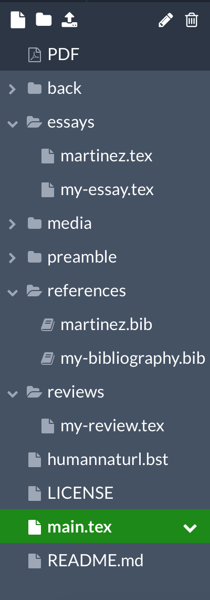

## Information for Authors
As from issue 15, authors contributing to [Variants](https://journals.openedition.org/variants) can also submit their articles or reviews in LaTeX format. For some, this may mean a new way of working. At first sight, a LaTeX file looks rather daunting and indeed it takes some getting used to. Luckily there are many great introductions and handy templates to get you started. And there are userfriendly applications like [Overleaf](https://overleaf.com) that will help you write and visualize LaTeX. 

If you are new to these technologies, and want to learn more about LaTeX and Overleaf, please check out our [FAQ](https://github.com/WoutDLN/LaTeXJournal_Variants/wiki/FAQ) before continuing here. In what follows, we will explain step-by-step how to work with the Variants template in Overleaf. 


### Step 1. Creating an Overleaf-account
In a web browser of your choice, visit [https://overleaf.com/](https://overleaf.com) and click on *Register* in the upper right corner. You have the option to log in with a social media-account, but we recommend you register with your email address. Once you have registered, you are taken to a welcome screen in which you can choose from three options: take a look at the templates, go to the LaTeX help guide or create a new project. We will be using a template that was specifically developed for authors of the *Variants* Journal. 

If you already know LaTeX and prefer to use your own (open source) software to compose your submission, you can skip Step 2 and [download the source of our Variants For Authors template from GitHub](https://github.com/WoutDLN/Variants-For-Authors). 

### Step 2. Opening the Variants Template
Once you have created an account, you can follow [this link to the Overleaf Template we designed for our Authors](https://www.overleaf.com/latex/templates/submission-template-to-variants-for-authors/znsqffgrvshv). If you're not logged in yet, do so now (top right corner), and press the **Open as Template** button. This will start a new LaTeX project in your Overleaf Account, that already includes the bare-bones structure of our template.

### Step 3. Navigating the Template
Once you have opened the template, you will find template's tree-structure with drop-down menus on the left.  The template will open in the `tex` file `main.tex`. 

<figure class="float-left">
	
	<figcaption>Navigation menu for the template in Overleaf.</figcaption>
</figure> 

`main.tex` describes a series of commands that tie the document together. By clicking on the PDF icon on the top of the menu structure, you can have a look at how the document will be visualized, and by clicking on the 'split screen' icon (on the top left of your browser window) you can visualize both the code and the PDF side by side.

`main.tex` starts with referencing a number of formatting rules that are defined in `\documentclass` and `\include{preamble/all}`, and then opens the document: 

```
\documentclass[]{scrbook}   
\include{preamble/all}

\begin{document}
\sloppy                         % preferences more space between words over overrunning margins
\lefthyphenmin=3                % suppresses hyphenation after only 1 or 2 characters

\pagenumbering{roman}           
\tableofcontents  
\thispagestyle{empty}
\pagenumbering{arabic}

\part{Essays}
\include{essays/my-essay}
% \include{essays/martinez}     % uncomment to visualize the sample essay

\part{Reviews}
\include{reviews/my-review}

\include{back/authors}
\end{document}
```
As you may have guessed, the `\include` command allows us to *include* a number of different documents (also `.tex` files) in the template's larger structure. `include{preamble/all}`, for example, will include the `all.tex` file that can be found in the `preamble` folder in the navigation menu. Similarly, the two documents that we will be working with (`my-essay.tex` and `my-review.tex`) can be respectively be found in the `essays` and `reviews` folders. Since they are both referenced in `main.tex` file, they will also be included in the PDF we are generating.